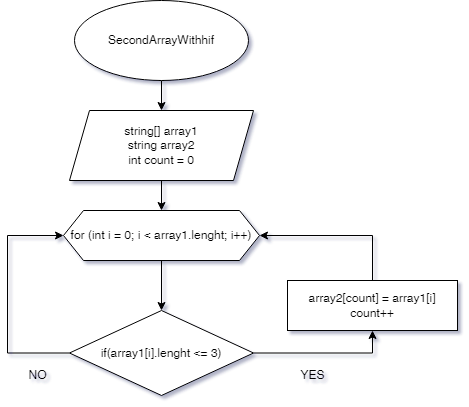

## Условие задачи:

Написать программу, которая из имеющегося массива строк формирует массив из строк, длина которых меньше либо равна 3 символа. Первоначальный массив можно ввести с клавиатуры, либо задать на старте выполнения алгоритма. При решение не рекомендуется пользоваться коллекциями, лучше обойтись исключительно массивами.

## Описание решения алгоритма:

Объявляем 2 массива: основной и дополнительный, равный по длинне. Далее исползуем цикл, который повторяется столько раз, сколько элементов содержит массив. Цикл проверет длинну строк, содержащихся в основном массиве. А именно условие, при котором строка меньше или равна трем символам. Если строка удовлетворяет условию, то она заносится во второй массив. (Count увеличивается на 1 и возвращается к циклу в котором i также увеливается на 1 и т.д до самого конца.)

## Блок схема(Алгоритм):

